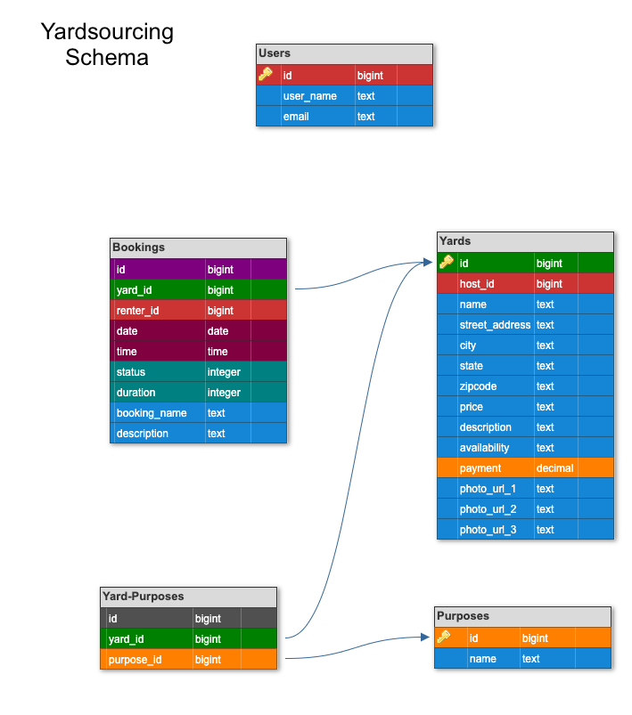

# Yardsourcing Engine

This is the engine fueling Yardsourcing, the web application. This API has 14 endpoints that allow Google authenticated users to store Yards (with full CRUD functionality), search yards by address and status, create and cancel bookings, and view all upcoming bookings. There is automatic email functionality that confirms bookings and approvals from hosts. To utilize this functionality, please set up the Sendgrid Microservice (see related repos).

#### Related Repos
To explore the full web application, please visit the built out front end application that hooks into this engine and its endpoints.
 - [Yardsourcing - frontend](https://github.com/Yardsourcing/yardsourcing-frontend).

To set up automatic email confirmation, please visit the Sendgrid microservice.
  - [Sendgrid Microservice](https://github.com/Yardsourcing/yardsourcing-sendgrid)


Have you ever been sitting in your apartment wishing you could bask in the sun on a lawn chair sipping a nice cool beverage? Now you can and you don't even need to leave your city! Yardsourcing is a web application that allows users to create accounts, browse yards available for rent or list your own outdoor space! Whether you need a pet friendly yard, a party yard or a place to do your outdoor hobby - Yardsourcing has you covered!

### Created by:
- [Alexa Morales Smyth](https://github.com/amsmyth1) | [LinkedIn](https://www.linkedin.com/in/moralesalexa/)
- [Genevieve Nuebel](https://github.com/Gvieve) | [LinkedIn](https://www.linkedin.com/in/genevieve-nuebel)
- [Dominic Padula]() | [LinkedIn]()
- [Jenny Branham](https://github.com/jbranham1) | [LinkedIn](https://www.linkedin.com/in/jenny-branham)
- [Jordan Beck](https://github.com/jordanfbeck0528) | [LinkedIn](https://www.linkedin.com/in/jordan-f-beck/)
- [Angel Breaux](https://github.com/abreaux26) | [LinkedIn](https://www.linkedin.com/in/angel-breaux)
- [Doug Welchons](https://github.com/DougWelchons/) | [LinkedIn](https://www.linkedin.com/in/douglas-welchons)

#### Built With
* [Ruby on Rails](https://rubyonrails.org)
* [HTML](https://html.com)
* [JavaScript](https://www.javascript.com)
* [Bootstrap](https://getbootstrap.com/)

This project was tested with:
* RSpec version 3.10

## Contents
- [Getting Started](#getting-started)
  - [Prerequisites](#prerequisites)
  - [Installing](#installing)
- [Endpoints](#endpoints)  
- [Database Schema](#database-schema)  
- [Application Features](#application-features)
  - [Feature 1](#feature-1)
- [Testing](#testing)
- [How to Contribute](#how-to-contribute)
- [Roadmap](#roadmap)
- [Contributors](#contributors)
- [Acknowledgments](#acknowledgments)

### Getting Started

These instructions will get you a copy of the project up and running on your local machine for development and testing purposes. See deployment for notes on how to deploy the project on a live system.

#### Prerequisites

* __Ruby__

  - The project is built with rubyonrails using __ruby version 2.5.3p105__, you must install ruby on your local machine first. Please visit the [ruby](https://www.ruby-lang.org/en/documentation/installation/) home page to get set up. _Please ensure you install the version of ruby noted above._

* __Rails__
  ```sh
  gem install rails --version 5.2.5
  ```

* __Postgres database__
  - Visit the [postgresapp](https://postgresapp.com/downloads.html) homepage and follow their instructions to download the latest version of Postgres app.

* __Google Oauth API__
  - Visit the [google developer tools](https://console.developers.google.com/project) to create an account and follow the instructions to create a project for your server to obtain a client_id and client_secret.

* __Omniauth for Rails__
  Visit the [google api omniauth](https://www.twilio.com/blog/2014/09/gmail-api-oauth-rails.html) homepage and follow their instructions to get familiar with how to use Omniauth in a rails application.


#### Installing

1. Clone the repo
  ```
  $ git clone https://github.com/Yardsourcing/yardsourcing-frontend
  ```

2. Bundle Install
  ```
  $ bundle install
  ```

3. Create, migrate and seed rails database
  ```
  $ rails db:{create,migrate,seed}
  ```

  If you do not wish to use the sample data provided to seed your database, replace the commands in `db/seeds.rb` and the data dump file in `db/data/rails-engine-development.pgdump`.

### Endpoints
| HTTP verbs | Paths  | Used for |
| ---------- | ------ | --------:|
| GET | /api/v1/purposes | Get the available purposes |
| GET | /api/v1/yards/:yard_id  | Get a yard's show page |
| POST | /api/v1/yards  | Create a new yard |
| DELETE | /api/v1/yards/:yard_id  | Delete a yard |
| PUT | /api/v1/yards/:yard_id | Update a yard |
| GET | /api/v1/hosts/host_id/bookings?status=STATUS | Get all bookings for a host that have a particular status|
| GET | /api/v1/renters/renter_id/bookings?status=STATUS | Get all bookings for a renter that have a particular status|
| GET | /api/v1/yards?location=ZIP&purposes=PURPOSE+NAME&OTHER+PURPOSE+NAME  | Get yards that match search criteria. |
| GET | /api/v1/hosts/host_id/yards  | Get yards that belong to a host |
| GET | /api/v1/yards/:yard_id/bookings | Get bookings that belong to a specific yard |
| POST | /api/v1/bookings | Create a new booking |
| GET | /api/v1/bookings/:booking_id | Get booking show page |
| DELETE | /api/v1/bookings/:booking_id | Delete a new booking |


### Database Schema



### Application Features
##### Feature 1
- Some really good info

### Testing
##### Running Tests
- To run the full test suite run the below in your terminal:
```
$ bundle exec rspec
```
- To run an individual test file run the below in tour terminal:
```
$ bundle exec rspec <file path>
```
for example: `bundle exec rspec spec/features/host/dashboard/index_spec.rb`

### How to Contribute

In the spirit of collaboration, things done together are better than done on our own. If you have any amazing ideas or contributions on how we can improve this API they are **greatly appreciated**. To contribute:

  1. Fork the Project
  2. Create your Feature Branch (`git checkout -b feature/AmazingFeature`)
  3. Commit your Changes (`git commit -m 'Add some AmazingFeature'`)
  4. Push to the Branch (`git push origin feature/AmazingFeature`)
  5. Open a Pull Request

### Roadmap

See the [open issues](https://github.com/Yardsourcing/yardsourcing-frontend/issues) for a list of proposed features (and known issues). Please open an issue ticket if you see an existing error or bug.

### Contributors
- [Alexa Morales Smyth](https://github.com/amsmyth1)
- [Genevieve Nuebel](https://github.com/Gvieve)
- [Dominic Padula]() [LinkedIn]()
- [Jenny Branham](https://github.com/jbranham1)
- [Jordan Beck](https://github.com/jordanfbeck0528)
- [Angel Breaux](https://github.com/abreaux26)
- [Doug Welchons](https://github.com/DougWelchons/)

  See also the list of
  [contributors](https://github.com/Yardsourcing/yardsourcing-frontend/graphs/contributors)
  who participated in this project.

### Acknowledgments
  - Our fantastically wizard like Project Manager and Instructor at [Turing School of Software and Design](https://turing.io/):
    * Ian Douglas
